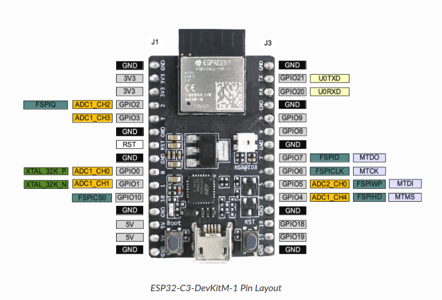

# Wi‑Fi Dual‑Channel IR Remote for LG & Samsung TVs

A **wireless web‑based remote** built on an ESP32, capable of controlling **LG** and **Samsung** televisions via **two independent IR channels**. The device hosts a responsive web UI that displays a graphical remote: select your TV brand, choose which IR channel to use, then press virtual buttons—just like a physical remote.

---

## Features

* **Dual IR Channels**: Control two IR LEDs (e.g. left/right) independently
* **TV Brand Selection**: LG or Samsung protocols in NEC format (38 kHz, 32 bits)
* **Graphical Web UI**: HTML/CSS/JS interface served from SPIFFS
* **Stable Carrier**: Hardware timer interrupt generates precise 38 kHz
* **Async Web Server**: Fast non‑blocking HTTP handling with `ESPAsyncWebServer`
* **Learn & Customize**: Optional IR receiver to capture codes, modify key mappings

---

## Hardware Requirements

* **ESP32** development board (e.g. ESP32‑C3 DevKit)
* **2 × IR LED modules** (each driven via an NPN transistor or driver)
* **1 × IR receiver** (e.g. TSOP38238) for code learning (optional)
* Common **3.3 V** supply and **GND**
* **Pull‑up/down resistors**, **transistors**, etc. as per wiring diagram

**GPIO Connections** (example):

| Function         | ESP32 Pin | Module              |
| ---------------- | --------- | ------------------- |
| IR Receiver      | GPIO2     | TSOP382             |
| IR LED Channel A | GPIO0     | IR LED + transistor |
| IR LED Channel B | GPIO2     | IR LED + transistor |
| (Optional LED)   | GPIO3     | Status LED          |



For more information on the ESP32 platform, refer to:
* **Official Espressif ESP32 Series documentation**: [https://docs.espressif.com/projects/esp-idf/en/v4.3/esp32c3/hw-reference/esp32c3/user-guide-devkitm-1.html](https://docs.espressif.com/projects/esp-idf/en/v4.3/esp32c3/hw-reference/esp32c3/user-guide-devkitm-1.html)

---

## Software Setup

1. **Install PlatformIO** in VS Code
2. Clone this repo:

   ```bash
   git clone https://github.com/yourname/esp32-ir-dual-remote.git
   cd esp32-ir-dual-remote
   ```
3. **Dependencies** in `platformio.ini`:

   ```ini
   [env:esp32-c3-devkitm-1]
   platform = espressif32
   board    = esp32-c3-devkitm-1
   framework= arduino
   lib_deps =
     crankyoldgit/IRremoteESP8266@^2.8.6
     me-no-dev/ESPAsyncWebServer@^1.2.3
     me-no-dev/AsyncTCP@^1.1.1
     bblanchon/ArduinoJson@^6.21.4
   
   monitor_speed = 115200
   ```
4. **Configure Wi‑Fi Credentials**:

   * Copy `Security.h` into `include/` (or `src/`), with your network settings:

     ```cpp
     #ifndef SK_SECURITY_H
     #define SK_SECURITY_H

     const char* ssid = "Your SSID";
     const char* password = "Your PASS";

     #endif
     ```
   * The firmware includes this header to connect to your Wi‑Fi network at startup.

5. **Place Web Assets** in `data/`:

   * `index.html`, `css/style.css`, `script.js`
6. **Build & Flash**:

   ```bash
   pio run --target upload
   pio run --target uploadfs   # upload SPIFFS image
   ```
   **Using VS Code + PlatformIO GUI:**

a. In VS Code, open the **PlatformIO** extension (house icon) in the left activity bar.

* In **PlatformIO Home**, select the **Platform** tab.

* Click **Build Filesystem Image** to compile the contents of the `data/` folder into `spiffs.bin`.

* After the build completes, click **Upload Filesystem Image** to flash the SPIFFS image to your ESP32.

* Finally, under **Project Tasks → <your board> → Upload**, click **Upload** to flash the main application firmware.

13. **Open Web UI** at `http://<ESP32_IP>/` and start controlling your TV.

---

## 🎛 Web Interface

1. **Brand Selector**: Choose **LG** or **Samsung**.
2. **Channel Selector**: Route commands to **Left** or **Right** (left/right IR LED).
3. **Control Buttons**: Power, navigation arrows, volume, channel, play/pause, Mute, etc.

Buttons send JSON:

```json
{ "brand": "LG", "channel": "left", "cmd": "volup" }
```

Server acknowledges and, once the HTTP response is fully sent, the corresponding IR signal is emitted.

---

## 🔧 Customization

* **Add TV Brands**: Define new `RemoteCodes_<Brand>` in `IRCodes.h`
* **Adjust IR Pins**: Change `IR_SEND_PIN_A` / `IR_SEND_PIN_B` in `main.cpp`
* **Update UI Layout**: Modify `data/index.html`, CSS, or add icons

